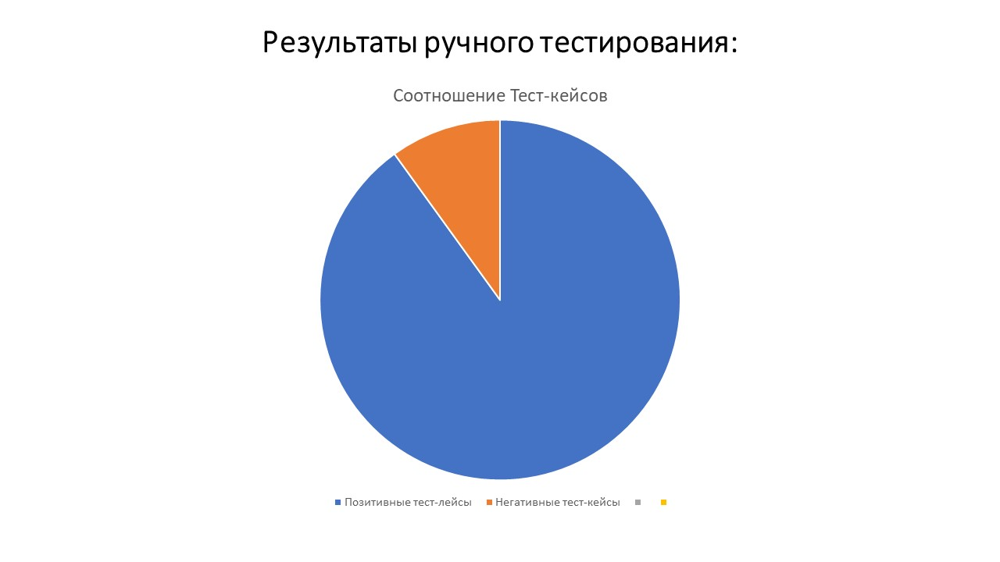

### Отчет о проведении ручного тестирования

В ходе ручного тестирования было проведено 673 теста, описанных в файле [Тест-кейсы](https://docs.google.com/spreadsheets/d/1r4ZZs8SwhNFJTdhG0v3x4JviyeYnAbFY/edit?gid=1191533890#gid=1191533890)

Выявлено 69 ошибок

[Баг-репорты по итогам ручного тестирования](https://github.com/OlgaChamina/Diplom2025/issues)

### Отчет о проведении автоматизированного тестирования

В ходе проведения ручного тестирования было принято решение о автоматизации некоторых тест кейсов, как позитивных, так и негативных.
Автоматизации приемущественно подверглись тест-кейсы, содержащие проверку основного функционала приложения, навигацию по приложению, проверку видимости некоторых важных элементов.
Было реализовано 66 тест-кейсов
8 из которых, выявляют ошибку

1. [Создание новости только с символьными данными в поле Заголовок](https://github.com/OlgaChamina/Diplom2025/issues/58)
2. [Создание новости только с численными данными в поле Заголовок](https://github.com/OlgaChamina/Diplom2025/issues/66)
3. [Создание новости только с символьными данными в поле Описание](https://github.com/OlgaChamina/Diplom2025/issues/56)
4. [Создание новости только с численными данными в поле Описание](https://github.com/OlgaChamina/Diplom2025/issues/67)
5. [Создание новости с несуществующей категорией](https://github.com/OlgaChamina/Diplom2025/issues/59)
6. [Создание новости с датой публикации в прошлом](https://github.com/OlgaChamina/Diplom2025/issues/68)
7. [Переход со страницы Новости на страницу О приложении кнопкой Главное меню в AppBar](https://github.com/OlgaChamina/Diplom2025/issues/65)
8. [Фильтрация для поиска вновь созданной новости на странице Новости по категории Объявление невозможна](https://github.com/OlgaChamina/Diplom2025/issues/69)

Так же присутствует ложное падение некотых тестов только при пакетном прогоне.
